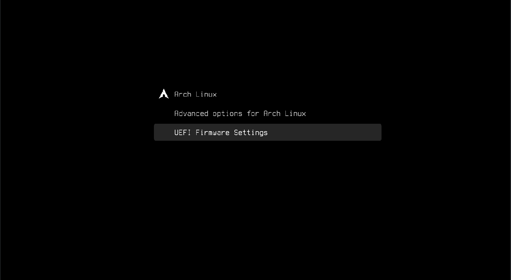

<div align="center">

# 🖥️ Minimal GRUB Theme



Minimalistic GRUB theme inspired by

[primitivistical](https://gitlab.com/fffred/primitivistical-grub/-/tree/master/) •
[vimix](https://github.com/vinceliuice/grub2-themes)


</div>

---

## ✨ Overview

A clean and distraction-free **GRUB bootloader theme** focused on minimal design and readability.

Designed to provide a modern boot experience without unnecessary visual noise.

---

## 🚀 Installation

### Requirements

- **GRUB ≥ 2.04**

---

### Install Theme

```bash
make install
```

---

### Uninstall Theme

```bash
make uninstall
```

---

## 🧪 Theme Emulator

Preview the theme without rebooting.

### Initial setup

```bash
make emulator/init
```

### Start emulator

```bash
make emulator/start
```

### Check emulator version

```bash
make emulator/version
```

---

## 🎯 Design Goals

- Minimal visual style
- Fast readability
- Clean typography
- Distraction-free boot menu
- Lightweight configuration

---

## 📚 References

- [GRUB Manual](https://www.gnu.org/software/grub/manual/grub/grub.html)
- [GRUB Theme Preview Tool](https://github.com/hartwork/grub2-theme-preview)
- [GRUB Theme Tutorial](http://wiki.rosalab.ru/en/index.php/Grub2_theme_tutorial)
- [GNOME-Look GRUB Themes](https://www.gnome-look.org/browse/cat/109/order/latest/)

---

## 📄 License

MIT License
